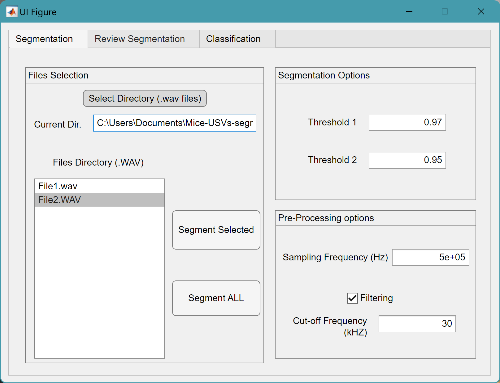
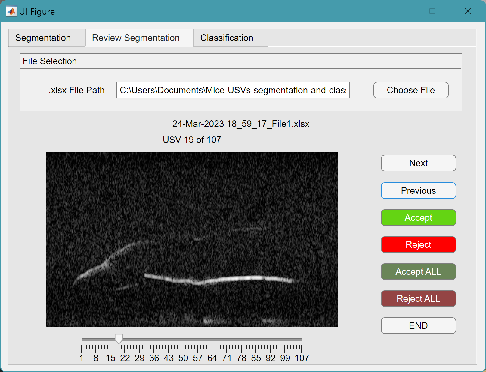
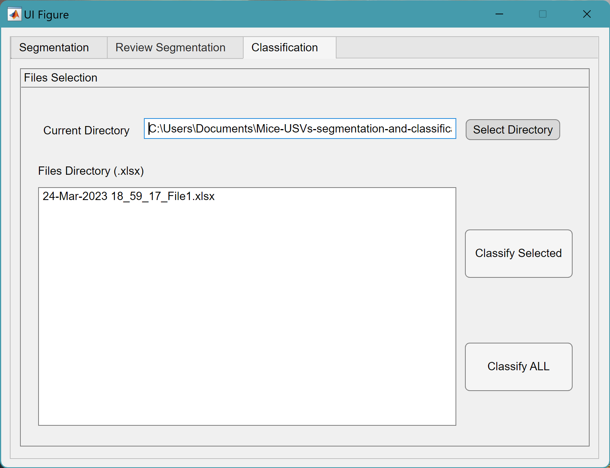

# Mice-USVs-segmentation-and-classification

MATLAB interface to segment and classify mice ultrasonic vocalizations (USVs). Developed with MATLAB 2022b.

In case you use our models, please cite the following articles:
 - Diogo Pessoa, Lorena Petrella, Pedro Martins, Miguel Castelo-Branco, and César Teixeira , "Automatic segmentation and classification of mice ultrasonic vocalizations", The Journal of the Acoustical Society of America 152, 266-280 (2022) https://doi.org/10.1121/10.0012350
 - Pessoa, D., Petrella, L., Castelo-Branco, M., Teixeira, C. (2020). Automatic Segmentation of Ultrasonic Vocalizations in Rodents. In: Henriques, J., Neves, N., de Carvalho, P. (eds) XV Mediterranean Conference on Medical and Biological Engineering and Computing – MEDICON 2019. MEDICON 2019. IFMBE Proceedings, vol 76. Springer, Cham. https://doi.org/10.1007/978-3-030-31635-8_5
 - Pessoa, D. R. M. (2019). Automatic classification of ultrasonic vocalizations in rodents: A Neurodevelopmental Study (Master's thesis). https://estudogeral.uc.pt/handle/10316/87998 

## -Application Funcionalities

#### 1) Automatic segmentation of USVs based on spectral entropy

#### 2) Manual review of segmented files USVs'

#### 3) Automatic classification of USVs' using machine learning

